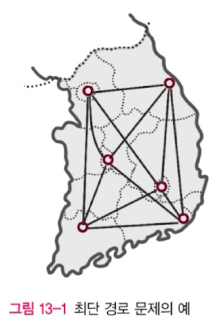

# 최단 경로 문제

- 각 간선의 가중치합이 최소가 되는 두 정점 사이의 경로를 찾는 문제. 지도상의 두 지점 사이의 최단 거리를 찾는 문제와 비슷하다.
- 그래프의 종류와 특성에 따라 최적화된 다양한 최단 경로 알고리즘이 있다. 가장 대표적인 알고리즘으로는 Dijkstra가 있다.

## 다익스트라 알고리즘

- 다익스트라는 네덜란드의 컴퓨터 과학자
- 다익스트라 알고리즘은 항상 노드 주변의 최단 경로만을 택하는 **그리디 알고리즘**이다. 단순하며 빠르다. BFS를 사용하는 대표적인 알고리즘.

- **한계**
  (보충)

  - 가중치가 음수인 경우에는 사용할 수 없다.
  - 다익스트라는 임의의 정점을 출발 집합에 더할 때 그 정점까지의 최단 거리는 계산이 끝났다는 확신을 갖고 더한다.
    만일 음수로 인해 이후에 더 짧은 경로가 존재한다면 다익스트라 알고리즘의 논리적 기반이 무너지기 때문에 음수는 처리할 수 없다.
    이런 경우 모두 값을 더해서 양수로 변환하는 방법이 있으며, 이마저도 어렵다면 벨만-포드 알고리즘 같은, 음수 가중치를 계산할 수 있는 알고리즘을 사용해야 한다. (음수 간선 사이클이 없다면 다익스트라를 사용할 수 있다. (불확실)) 

- 다익스트라가 처음 알고리즘을 만들었을 때 시간 복잡도는 O(V^2)였지만 **우선순위 큐**를 적용하면 O((V+E)log V)로 줄일 수 있다.
  모든 정점이 출발지에서 도달이 가능하다면 최종적으로 O(ElogV)가 된다.

- 참고자료
  - [[파이썬]알고리즘 이야기(04. 네비게이션 길찾기: 다익스트라 알고리즘-개념편)](https://youtu.be/qaiuC3Q73-M?si=cLXQZIk7ddSD_Kv2) - 짧지만 명쾌한 설명.
