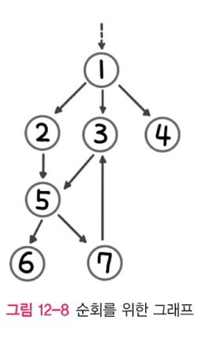

# 그래프 순회

- 그래프 순회는 그래프 탐색이라고도 하며 그래프의 각 정점(Vertex)을 방문하는 과정을 말한다.
- 그래프 순회 방법은 DFS(깊이 우선 탐색), BFS(너비 우선 탐색)가 있다. 일반적으로 DFS가 BFS에 비해 널리 쓰인다. 코딩 테스트의 대부분의 그래프 탐색은 DFS로 구현하게 될 것이다.



위 그래프를 예시로 DFS와 BFS를 구현해보자.

## 그래프

- 용어 정리
- 표현 방법
  - 인접 행렬
  - 인접 리스트

## DFS

- 주로 스택이나 재귀를 사용하여 구현한다.

### 재귀 구현

```java
public List<Integer> dfs(int v, List<Integer> discovered) {
    discovered.add(v);                // 방문한 정점 추가
    for (int w : graph.adj(v))        // 방문한 정점과 인접한 정점 탐색
        if (!discovered.contains(w))  // 방문하지 않은 정점이라면
            dfs(w, discovered);       // 재귀 호출
    return discovered;                // 방문한 정점 반환
}
```

- **결과** : [1, 2, 5, 6, 7, 3, 4]


### 스택 구현

```java
public List<Integer> iterativeDFS(int v) {
    List<Integer> discovered = new ArrayList<>();
    Deque<Integer> stack = new ArrayDeque<>();
    stack.push(v);
    while (!stack.isEmpty()) {
        v = stack.pop();
        if (!discovered.contains(v)) {
            discovered.add(v);
            for (int x : graph.adj(v))
                stack.push(x);
        }
    }
    return discovered;
}
```

- **결과** : [1, 4, 3, 5, 7, 6, 2]
- 재귀 구현과 스택 구현은 정점을 방문하는 순서가 역순이다.

- 재귀 구현보다 우아함이 떨어지고 코드도 길지만 직관적이고 실행 시간도 빠르다.

### 백트래킹

DFS를 이야기하다 보면 항상 **백트래킹**이 언급된다. 백트래킹은 DFS보다 더 넓은 의미로 사용되는 용어다. 해결책에 대한 후보를 구축해 나가다 가능성이 없다고 판단되는 즉시 후보를 포기해 정답을 찾아가는 범용적인 알고리즘으로, **제약 충족 문제**등에 유용한다. 백트래킹은 탐색을 하다가 더 갈 수 없으면 왔던 길을 되돌아가 다른 길을 찾는다는 데서 유래했다. 주로 **재귀로 구현**된다.


위와 같이 큰 트리를 브루트 포스로 전체 트리를 탐색하면 매우 긴 시간이 소요된다. 이럴 때 아래 그림처럼 DFS로 탐색을 시도하고 가능성이 없는 후보는 즉시 포기하고 백트래킹한다면 트리의 불필요한 거의 대부분을 버릴 수 있다.

<center></center>

이를 트리의 **가지치기**라고 한다.

> **제약 충족 문제(Constraint Satisfaction Problem, CSP)란?**
>
> 스도쿠는 1에서 9까지 숫자를 한 번만 넣는(제약 조건 충족) 정답(상태)을 찾아내는 문제다. 이런 문제를 제약 충족 문제라고 한다.
> 스도쿠를 잘 풀이하려면 백트래킹을 하면서 가지치기를 통해 최적화를 하는 형태로 풀이할 수 있다.

## BFS

- 주로 큐를 사용하여 구현한다. DFS와 달리 **재귀 구현은 불가**하다.
- 그래프의 **최단 경로**(다익스트라 알고리즘 등)를 구하는 문제에 사용된다.

### 큐 구현

```java
public List<Integer> iterativeBFS(int start_v) {
    List<Integer> discovered = new ArrayList<>();
    Queue<Integer> queue = new ArrayDeque<>();
    discovered.add(start_v);
    queue.add(start_v);
    while (!queue.isEmpty()) {
        int v = queue.poll();
        for (int w : graph.adj(v))
            if (!discovered.contains(w)) {
                discovered.add(w);
                queue.add(w);
            }
    }
    return discovered;
}
```
