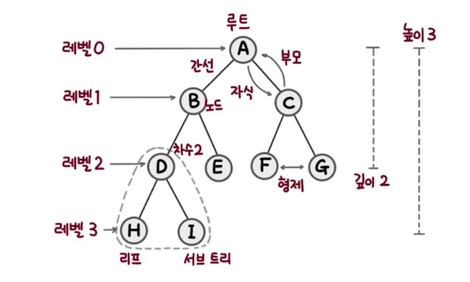
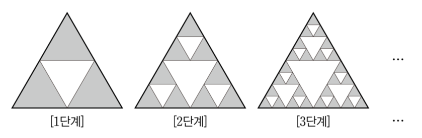
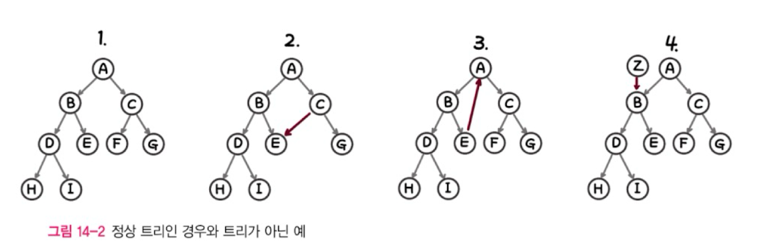
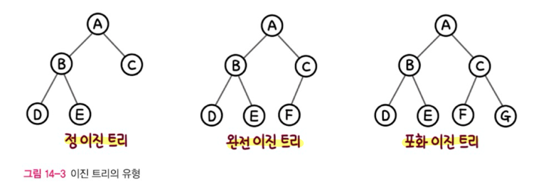

# 트리

- 계층형 트리 구조를 시뮬레이션하는 추상 자료형(ADT)이다. 
- 루트와 부모-자식 관계의 서브 트리로 구성. 
- 서로 연결된 노드의 집합.

- 트리의 중요한 속성 중 하나는 **재귀로 정의된 자기 참조 자료구조**이다. 트리는 자식도 트리고 또 그 자식도 트리다. (프랙탈?) 여러 개의 트리가 쌓아 올려져 큰 트리가 된다.

    
  
  재귀적 특성 때문에 트리를 순회할 때 재귀를 이용한 순회가 자연스럽다.

## 트리의 명칭

- 트리는 항상 **루트**에서 시작된다.
- 루트는 **자식 노드**를 가지며, 자식과는 **간선**으로 연결된다.
- 자식 노드의 개수는 **차수**다.
- **크기**(size)는 자신을 포함한 모든 자식 노드의 개수다.
- **높이**는 현재 위치에서부터 리프까지의 거리, **깊이**는 루트에서 현재 노드까지의 거리다.
- **레벨**은 0부터 시작
- 트리는 항상 **단방향**이다. 위에서 아래로 향한다.

## 그래프와 트리의 차이점

> **트리는 순환 구조를 갖지 않는 그래프다.**

- 트리는 특수한 형태의 그래프의 일종이다. 
- 부모는 오직 하나여야 한다.
- 단방향

## 이진 트리
트리 중에서 가장 널리사용되는 형태는 **이진 트리**와 **이진 탐색 트리**다. 모든 노드의 차수(자식 수)가 2 이하 일 때는 특별히 이진 트리라고 한다. 대체로 트리라고 하면 특별한 경우가 아니면 이진 트리를 의미한다. 

- **정 이진 트리 (Full Binary Tree)**
    - 모든 노드가 0개 또는 2개의 자식을 가진다.
- **완전 이진 트리 (Complete Binary Tree)**
  - 마지막 레벨을 제외한 모든 레벨이 완전히 채워져 있고, 마지막 레벨의 모든 노드가 왼쪽부터 채워져 있다.
- **포화 이진 트리 (Perfect Binary Tree)**
  - 모든 레벨이 완전히 채워져 있다. 대칭이다.

