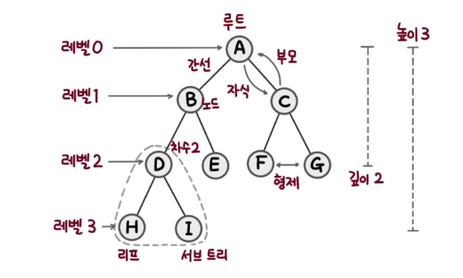
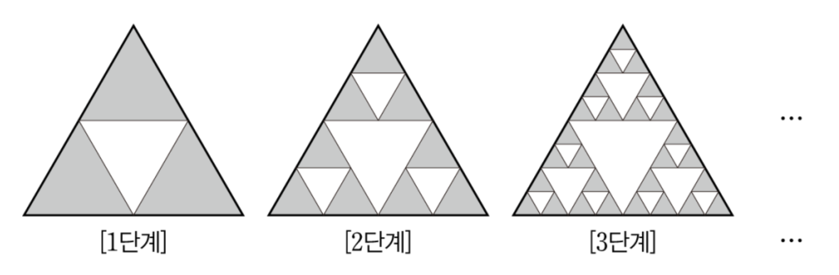

# 트리

- 계층형 트리 구조를 시뮬레이션하는 추상 자료형(ADT)이다. 
- 루트와 부모-자식 관계의 서브 트리로 구성. 
- 서로 연결된 노드의 집합.

- 트리의 중요한 속성 중 하나는 **재귀로 정의된 자기 참조 자료구조**이다. 트리는 자식도 트리고 또 그 자식도 트리다. (프랙탈?) 여러 개의 트리가 쌓아 올려져 큰 트리가 된다.

    
  
  재귀적 특성 때문에 트리를 순회할 때 재귀를 이용한 순회가 자연스럽다.

## 트리의 명칭

- 트리는 항상 **루트**에서 시작된다.
- 루트는 **자식 노드**를 가지며, 자식과는 **간선**으로 연결된다.
- 자식 노드의 개수는 **차수**다.
- **크기**(size)는 자신을 포함한 모든 자식 노드의 개수다.
- **높이**는 현재 위치에서부터 리프까지의 거리, **깊이**는 루트에서 현재 노드까지의 거리다.
- **레벨**은 0부터 시작
- 트리는 항상 **단방향**이다. 위에서 아래로 향한다.

## 그래프와 트리의 차이점